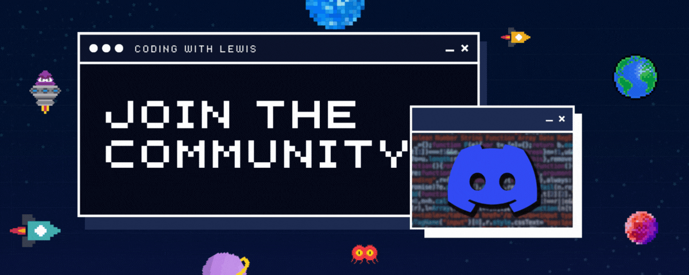

# YouTube AI Chat 🤖

- [YouTube AI Chat 🤖](#youtube-ai-chat-)
- [Chat with us on Discord](#chat-with-us-on-discord)
- [Download Link (For the Lazy) 🧑‍💻](#download-link-for-the-lazy-)
  - [About the Project](#about-the-project)
    - [How it Works](#how-it-works)
  - [Contributing](#contributing)
    - [Prerequisites](#prerequisites)
    - [How to Install](#how-to-install)
  - [IMPORTANT NOTES ⏰](#important-notes-)
    - [Philosophy](#philosophy)
    - [Respect to the Project / Contributors](#respect-to-the-project--contributors)
    - [🚨 DISCLAIMER 🚨](#-disclaimer-)

[**_SEE DISCLAIMER_**](#disclaimer)

# [Chat with us on Discord](https://dsc.gg/lewismenelaws)

# Download Link (For the Lazy) 🧑‍💻

[DOWNLOAD ▶️](https://chromewebstore.google.com/u/1/detail/youtubeaichat/pffkcbmbpncfkebklnbidgimnhgjkijg?hl=en-GB)

_please note that I can't guarantee uptime with this since it's using my API keys. For a more reliable option, you can follow the instructions below to run it yourself._

## About the Project

### How it Works

This extension uses the Plasmo Extension Framework to deploy a little chat bubble in the Shadow DOM. This connects with a backend that:

- Gets the transcript of the video using `yt-dlp`
- Embeds the transcript and puts it into a DataStax AstraDB Vector Database.
- Uses OpenAI's GPT-4 to generate a response to the user's message with context from AstraDB.
- Responds to the user.

## Contributing

### Prerequisites

- [Docker](https://docs.docker.com/get-docker/)🐳
- [DataStax AstraDB (really easy install)](https://www.datastax.com/lp/astra-registration?utm_medium=youtube_video&utm_source=datastax&utm_campaign=yt_influencers&utm_content=vector_search_lewis_menelaws)🚀
- `pnpm` or `npm` (I use `pnpm` but `npm` should work fine)📦

### How to Install

1. Clone the repository:
2. Open up a terminal and `cd extension` (this is the chrome extension)
3. In a code editor, rename `.env.example` to `.env` and fill in the values. For local development, you can leave the values as is.
4. run `pnpm install` or `npm install`
5. run `pnpm dev` or `npm run dev`
6. In your browser, make sure you have developer mode enabled, and load the extension from the `build/chrome-mv3-dev` folder.

Then to run the backend:

1. Open up a terminal and `cd endpoint` (assuming you are in the root of this project)
2. Similar to the extension, rename `.env.example` to `.env` and fill in the values. Fill in the required values.
3. run `docker compose up --build`. This will build the docker image and run it.
4. You should be good to go!

## IMPORTANT NOTES ⏰

### Philosophy

I see paid versions of this type of application everywhere and I thought it could be really simple to just make free. The amount of features that users would want is endless so I thought I would just make a simple version that works and then let the community build on top of it.

### Respect to the Project / Contributors

This is very early. If you are wanting to add features, report bugs or fix anything, please feel free to open a PR or an issue. I will be working on this in my spare time so I can't guarantee that I will be able to fix everything but I will try my best.

### 🚨 DISCLAIMER 🚨

DataStax is a sponsor of my social channels (Coding with Lewis). However, the links provided in this repository are NOT affiliate links. I do not receive kickback from the links put in this repository. I do not receive any financial benefit from this repository.

We are looking into ways we can provide a better experience for those who contribute to open source.
